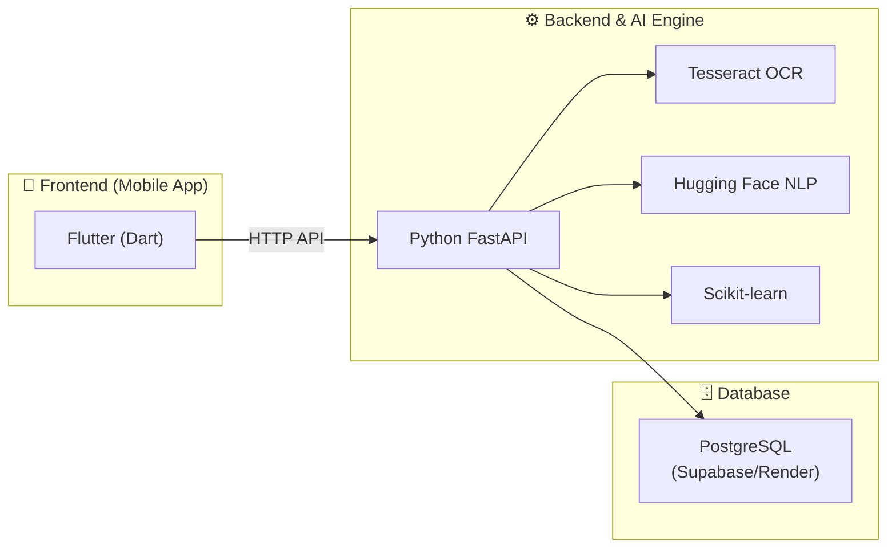
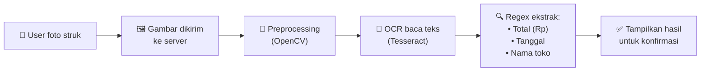
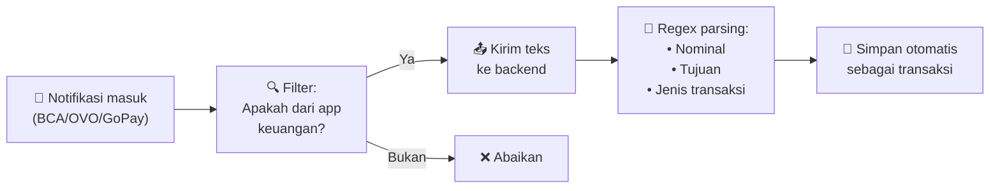
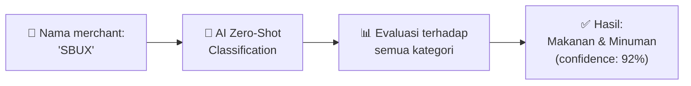
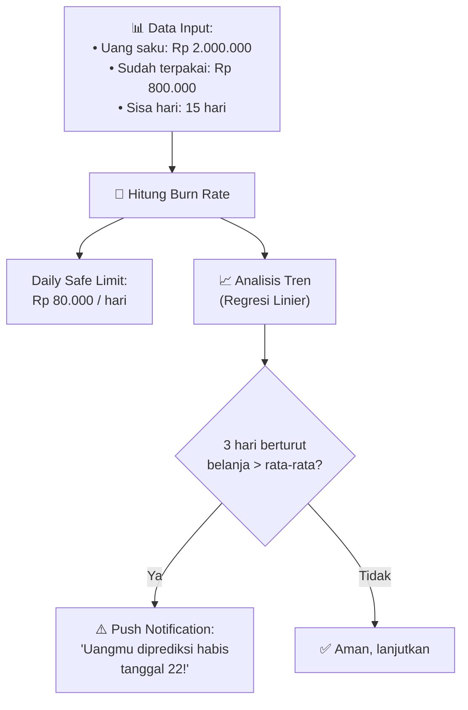
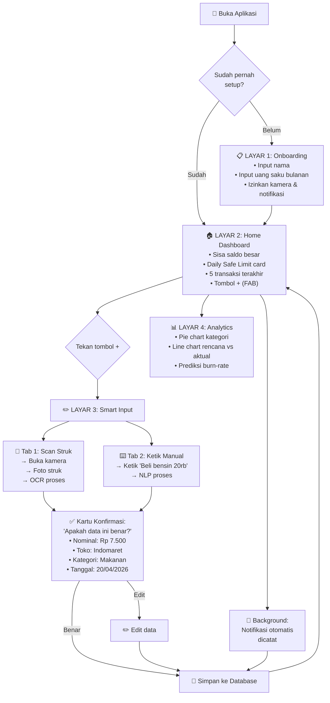
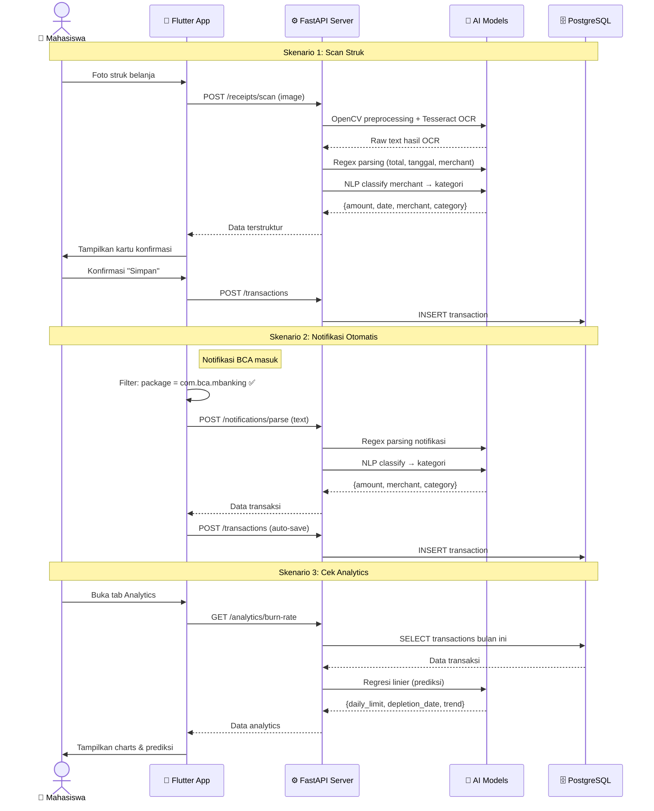

# FinSnap — Penjelasan Lengkap Aplikasi

## Apa itu FinSnap?

**FinSnap** (singkatan dari *Financial Snapshot*) adalah aplikasi pengelolaan keuangan pribadi yang dirancang khusus untuk **mahasiswa**. Masalah utama yang dipecahkan:

> *"Mahasiswa sering kehabisan uang di pertengahan bulan karena tidak mencatat pengeluaran. Pencatatan manual itu membosankan dan sering dilupakan."*

FinSnap menyelesaikan masalah ini dengan **AI (Kecerdasan Buatan)** yang mencatat pengeluaran **secara otomatis** — cukup foto struk atau biarkan aplikasi membaca notifikasi bank kamu.

---

## Tech Stack (Teknologi yang Digunakan)



| Layer | Teknologi | Fungsi |
|---|---|---|
| **Frontend** | Flutter (Dart) | Membuat tampilan aplikasi mobile yang responsif di Android/iOS |
| **Backend** | Python + FastAPI | Server yang menerima data, memproses AI, dan menyimpan ke database |
| **Database** | PostgreSQL (Supabase) | Menyimpan semua data pengguna dan transaksi di cloud |
| **OCR** | Tesseract OCR / Google ML Kit | Membaca teks dari foto struk belanja |
| **NLP** | Hugging Face (XLM-RoBERTa) | Mengkategorikan transaksi secara otomatis (Makanan, Transport, dll.) |
| **Prediksi** | Scikit-learn (Regresi Linier) | Memprediksi kapan uang akan habis berdasarkan pola belanja |

---

## 4 Core Features (Fitur Utama)

### 🔍 Fitur 1: AI Receipt Scanner (Pemindai Struk)

**Masalah:** Setiap kali belanja, kita dapat struk. Tapi siapa yang mau mengetik ulang totalnya?

**Solusi:** Cukup **foto struk**, AI yang baca.



**Cara kerja detail:**
1. User tekan tombol kamera → ambil foto struk → crop bagian penting
2. Gambar dikirim ke server FastAPI
3. **OpenCV** membersihkan gambar (grayscale, denoise, threshold) agar lebih mudah dibaca
4. **Tesseract OCR** membaca seluruh teks dari gambar (dengan bahasa Indonesia `lang='ind'`)
5. **Regex** mencari pola spesifik dalam teks:
   - Cari kata `"Total"`, `"Rp"`, `"Grand Total"` → ambil nominal uang
   - Cari format tanggal `DD/MM/YYYY` → ambil tanggal transaksi
   - Baris pertama/logo → ambil nama merchant (toko)
6. Hasilnya ditampilkan di layar untuk dikonfirmasi user sebelum disimpan

**Contoh:**
```
Struk dari Indomaret:
────────────────────
INDOMARET
Jl. Margonda Raya No.12
20/04/2026

Aqua 600ml      Rp  4.000
Indomie Goreng   Rp  3.500
────────────────────
TOTAL           Rp  7.500
```
→ AI ekstrak: **Toko: Indomaret**, **Total: Rp 7.500**, **Tanggal: 20/04/2026**

---

### 📲 Fitur 2: Auto-Parser Notifikasi (Pembaca Notifikasi Otomatis)

**Masalah:** Setiap kali transfer atau bayar via OVO/GoPay/BCA, kita dapat notifikasi. Tapi notifikasi itu tidak tercatat di mana-mana.

**Solusi:** Aplikasi **otomatis membaca** notifikasi dari app banking/e-wallet dan mencatat transaksi.



**Cara kerja detail:**
1. Menggunakan package Flutter `notification_listener_service` (khusus Android)
2. Aplikasi meminta **izin akses notifikasi** dari user
3. Setiap notifikasi masuk, aplikasi mengecek **package name**:
   - `com.bca.mbanking` → BCA Mobile
   - `id.co.dana` → DANA
   - `com.gojek.app` → Gojek/GoPay
   - `ovo.id` → OVO
   - `id.bmri.livin` → Livin by Mandiri
4. Jika cocok, teks notifikasi dikirim ke backend
5. Backend menggunakan **Regex** untuk mengekstrak:
   - Kata kunci: `"Berhasil transfer"`, `"Pembayaran"`, `"Top up"`
   - Nominal: angka setelah `Rp`
   - Tujuan: nama merchant/penerima
6. Disimpan otomatis sebagai transaksi baru

**Contoh notifikasi:**
```
"Pembayaran ke GRAB sebesar Rp25.000 berhasil. Saldo OVO: Rp150.000"
```
→ AI catat: **Merchant: GRAB**, **Jumlah: Rp 25.000**, **Kategori: Transportasi**

> [!NOTE]
> Fitur ini **hanya tersedia di Android** karena iOS tidak mengizinkan aplikasi membaca notifikasi dari app lain.

---

### 🏷️ Fitur 3: NLP Auto-Categorization (Pengkategorian Pintar)

**Masalah:** Nama merchant di struk sering aneh: `"KCP JKT SEL"`, `"SBUX"`, `"WM BAROKAH"`. User malas pilih kategori manual dari dropdown.

**Solusi:** AI secara otomatis menebak kategori yang tepat menggunakan **Zero-Shot Classification**.



**Cara kerja detail:**
1. Setelah OCR atau Notification Parser mendapatkan nama merchant, nama tersebut dikirim ke model NLP
2. Menggunakan model **`joeddav/xlm-roberta-large-xnli`** dari Hugging Face
3. Model mengevaluasi nama merchant terhadap **8 kategori**:

| Kategori | Contoh Merchant |
|---|---|
| 🍔 Makanan & Minuman | Starbucks, Warung Makan, KFC |
| 🚗 Transportasi | Grab, Gojek, Shell, Pertamina |
| 🛍️ Belanja | Tokopedia, Shopee, Uniqlo |
| 🎮 Hiburan | Netflix, Bioskop XXI, Steam |
| 💊 Kesehatan | Apotek K-24, Halodoc |
| 📚 Pendidikan | Gramedia, Coursera |
| 📄 Tagihan | PLN, Telkomsel, Indihome |
| ❓ Lainnya | Yang tidak terklasifikasi |

4. AI memberikan **confidence score** (tingkat keyakinan)
5. Jika confidence rendah (< 60%), user diminta memilih manual

**Kenapa Zero-Shot?**
- "Zero-shot" artinya model **tidak perlu dilatih ulang** untuk setiap merchant baru
- Cukup beri daftar kategori, model bisa menebak sendiri
- Mendukung **Bahasa Indonesia** karena menggunakan model multilingual (XLM-RoBERTa)

---

### 📉 Fitur 4: Predictive Burn-Rate (Prediksi Habisnya Uang)

**Masalah:** Mahasiswa sering tidak sadar uangnya sudah menipis sampai benar-benar habis.

**Solusi:** AI menghitung **batas aman belanja harian** dan **memprediksi kapan uang akan habis**.



**Cara kerja detail:**

**Langkah 1 — Hitung Batas Aman Harian (Rumus Sederhana):**
```
Daily Safe Limit = (Uang Saku - Total Pengeluaran) / Sisa Hari di Bulan Ini
```
Contoh: `(Rp 2.000.000 - Rp 800.000) / 15 hari = Rp 80.000/hari`

**Langkah 2 — Prediksi AI (Regresi Linier):**
- Menggunakan **scikit-learn** untuk membaca tren pengeluaran harian selama 7-14 hari terakhir
- Model regresi linier menghitung *slope* (kecenderungan naik/turun)
- Jika tren menunjukkan pengeluaran **di atas rata-rata aman selama 3 hari berturut-turut**, sistem mengirim peringatan

**Langkah 3 — Push Notification:**
```
"⚠️ Peringatan: Kecepatan belanjamu tinggi. 
Uangmu diprediksi habis pada tanggal 22 jika tidak dihentikan."
```

---

## App Flow (Alur Aplikasi)



---

## Detail Setiap Layar

### 📋 Layar 1: Onboarding & Setup
> *Hanya muncul sekali saat pertama kali buka aplikasi*

| Elemen | Deskripsi |
|---|---|
| Input Nama | Kolom teks untuk nama lengkap |
| Input Uang Saku | Angka uang saku bulanan (misal: Rp 2.000.000) |
| Izin Kamera | Pop-up minta izin akses kamera (untuk scan struk) |
| Izin Notifikasi | Pop-up minta izin baca notifikasi (untuk auto-parser) |
| Tombol "Mulai" | Menyimpan data dan masuk ke Home |

### 🏠 Layar 2: Home Dashboard
> *Layar utama yang selalu dilihat user*

| Elemen | Deskripsi |
|---|---|
| **Sisa Saldo** (besar) | Angka besar di atas: `Rp 1.250.000` |
| **Daily Safe Limit Card** | Widget mencolok: `Rp 45.000 / hari` — warna hijau jika aman, kuning jika menipis, merah jika bahaya |
| **Recent Transactions** | Daftar 5 transaksi terakhir dengan ikon kategori dan nominal |
| **FAB (Floating Action Button)** | Tombol `+` besar di tengah bawah — muncul menu: "Scan Struk" / "Ketik Manual" |
| **Navigation Bar** | Tab bawah: Home, Analytics, Settings |

### ✏️ Layar 3: Smart Input Form
> *Untuk menambahkan transaksi baru*

| Tab | Deskripsi |
|---|---|
| **Tab 1: Scan Camera** | Membuka viewfinder kamera → user foto struk → crop → kirim ke OCR |
| **Tab 2: Text Input** | Kolom teks bebas, contoh: `"Beli bensin 20 ribu tadi pagi"` → kirim ke NLP parser |
| **Kartu Konfirmasi** | Setelah diproses, muncul kartu: nominal, merchant, kategori (sudah diisi AI), tanggal. User bisa edit lalu tekan "Simpan" |

### 📊 Layar 4: Analytics & Insights
> *Visualisasi data keuangan*

| Elemen | Deskripsi |
|---|---|
| **Pie Chart** | Distribusi pengeluaran per kategori (Makanan 40%, Transport 25%, dll.) |
| **Line Chart** | Grafik garis: "Rencana Belanja" (garis lurus) vs "Belanja Aktual" (garis bergelombang) sepanjang bulan |
| **Burn-Rate Card** | Prediksi tanggal uang habis + saran penghematan |
| **Filter Waktu** | Pilih periode: Minggu ini / Bulan ini / 3 Bulan |

---

## Alur Data End-to-End



---

## Ringkasan Teknologi per Fitur

| Fitur | Flutter (Frontend) | FastAPI (Backend) | AI/ML |
|---|---|---|---|
| **Scan Struk** | `camera`, `image_picker` | `python-multipart` (file upload) | `pytesseract` + `opencv` + Regex |
| **Auto-Notifikasi** | `notification_listener_service` | Endpoint parsing | Regex per banking app |
| **Kategorisasi** | Tampilkan hasil + edit | Endpoint classify | `transformers` (Zero-Shot NLI) |
| **Prediksi** | `fl_chart` (visualisasi) | Endpoint analytics | `scikit-learn` (Linear Regression) |
| **UI/UX** | `flutter_riverpod`, `google_fonts` | — | — |
| **Database** | `dio` (HTTP client) | `sqlalchemy`, `asyncpg` | — |
